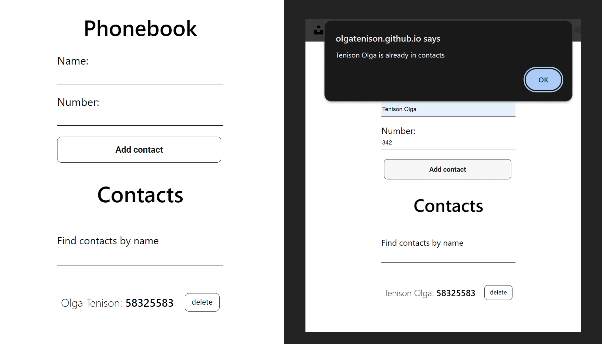

  

     
   

   
   # Phonebook

This repository contains the source code for a phonebook web application,
allowing users to store and manage their contacts. The application now includes
additional functionality for persisting contacts in the browser's local storage.

## Features

1. **Add Contacts:** Users can add new contacts by providing a name and phone
   number.

2. **Remove Contacts:** Users can delete saved contacts that are no longer
   needed.

3. **Search Contacts:** Provides the ability to quickly search for contacts by
   name.

4. **Local Storage:** Contacts are now stored in the local storage of the
   browser. Upon adding or removing a contact, the contacts are saved to and
   retrieved from local storage.

## Technologies

1. **React:** Utilizes the React library to build the user interface.

2. **Nanoid:** Used for generating unique identifiers for contacts.

## Getting Started

1. Clone the repository to your computer:
   `git clone https://github.com/yourusername/phonebook.git`

2. Install dependencies: `npm install`

3. Run the application: `npm start`

Feel free to customize this description according to your project and its
specifics.

Start template:
[Create React App](https://github.com/facebook/create-react-app).
